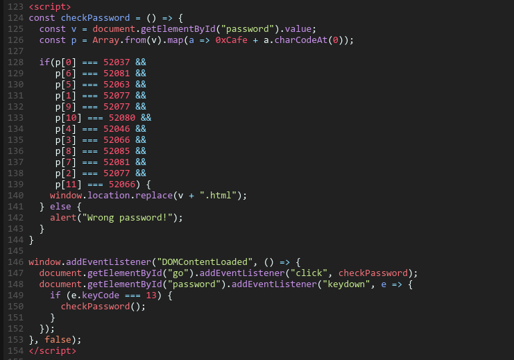

# Challenge 1: CCTV

`Challenge: CCTV (rev)
You arrive at your destination. The weather isn't great, so you figure there's no reason to stay outside and you make your way to one of the buildings. No one bothered you so far, so you decide to play it bold - you make yourself a cup of coffee in the social area like you totally belong here and proceed to find an empty room with a desk and a chair. You pull out our laptop, hook it up to the ethernet socket in the wall, and quickly find an internal CCTV panel - that's a way better way to look around unnoticed. Only problem is... it wants a password.`

Link: <https://cctv-web.2021.ctfcompetition.com/>

This is an easy challenge about Web Exploiting, first, get to the link


Seem like we need a password, view-source it:



We can see:

- `const v` store the password string that we enter (Line 125)
  
- Take each character in `v`, get its ASCII then sum with `0xCafe` (which is 51966 in Base-10) (Line 126)
- Now we get `const p` is an array which stores the sum of each character with `0xCafe` we got in step 2 (Line 126)
- Check each element of `p` with the number in if statements (Line 128-139), if `true` then we got the access

Easy peasy, let me a small program in Python to solve this:


Run it, and we get the password:


Let's try that password:


At the bottom-left corner, we got the Flag: `Important note: CTF{IJustHopeThisIsNotOnShodan}`


`You have now investigated the chemical plant. Nothing seemed to be out of the ordinary, even though the workers acted somewhat passive, but that’s not a good enough to track. It seems like you have a new voice mail from the boss: "Hello there, AGENT! It seems like the corporation that owns the plant was informed by an anonymous source that you would arrive, and therefore they were prepared for your visit, but your colleague AGENT X has a lead in Moscow, we’ve already booked you a flight. FIRST CLASS of course. In fact if you look out of the window, you should be able to see a black car arriving now, and it will carry you to the airport. Good luck!"`

# Challenge 2: Logic Lock (misc)

`Challenge: Logic Lock (misc)
It turned out suspect's appartment has an electronic lock. After analyzing the PCB and looking up the chips you come to the conclusion that it's just a set of logic gates!`

This is a easy challenge about logic gates, here is the picture Google gives us


So, we need to check which input should be `1` to get `1` in final output
I'm not so good with solving this in brain, so i had to write it down


Yay, we get the inputs: `BCFIJ`, so the flag is `CTF{BCFIJ}`


`Well, it’s a rather gloomy and messy apartment, a faint shade is cast from the almost covered master window upon the worn wall. It smells very burnt, and there's a cracked bottle in the sink that suggests some kind of experiment. Someone must have left in a hurry. Thinking about it, do you want to: Look at the beautiful view of the Kremlin from the window or search the apartment thoroughly`

# Challenge 3: Self-Driving car

`I forgot to save the description :v`

This is a funny code practice for Javascript
Your task is clear: complete the `function controlCar()` with param `scanArray`
The description:

```text
Car Self-Driving Interface

You need to re-implement the controlCar function.

To implement it in JavaScript use the editor on the left.

When implemented, controlCar function will be called several times per second during the chase to allow for course corrections.

The controlCar function takes a single parameter – scanArray – which is an array containing 17 integers denoting distance from your car to the nearest obstacle:
    [indexes 0-7]: on the left side of the car (index 7 is the measurement at the left headlight),
    [index 8]: at the center of the car,
    [indexes 9-16]: on the right side of the car (index 9 is the measurement at the right headlight).

See also this image (it's not precise, but will give you an idea what you are looking at).

All measurements are parallel to each other.

A negative measurement might appear if the obstacle is very close behind our car.

The controlCar must return an integer denoting where the car should drive:

    -1 (or any other negative value): drive more to the left,
    0: continue straight / straighten up the car,
    1 (or any other positive value): drive more to the right.
```

The given image:


Now we get (maybe) all things we need. This is a code challenge, as we can see in the picture:

- Let's call the column `[0]` `[1]` ... `[16]` is 'the rule'
- When the car moves left and right, the rule moves
- Our car is 3 units width (7 8 9), same as the lane and other cars
- We see that the left lane is the lane we need to change
- Each time we return (-1, 0, 1), we move 1 unit
- Move left 1 unit, `[7]` is 74, `[8]` and `[9]` is 21
- Move one more time, `[7]` and `[8]` is 74, `[9]` is 21
- Move one last time, both `[7]` and `[8]` and `[9]` is 74, now we can go straight
- Keep doing all these works above until we get to the final point

So, it's pretty clear what we should do:

- Get the `middle_point = scanArray[8]`  
  
- Find the `max_distance` and `max_index`, which is the index of `max_distance` in `scanArray`
  
- If `middle_point = max_distance`, we have 3 cases:
  - If `scanArray[7] != scanArray[9]`, which mean, we've just moved 2 units:
    - If `scanArray[7] > scanArray[9]`, the `[9]` still in old lane, we move to the left --> `return -1`  
    - If `scanArray[7] < scanArray[9]`, the `[7]` still in old lane, we move to the right --> `return 1`

    - Else, all the `[7]` `[8]` `[9]` is in new lane, we go straight --> `return 0`

- Else, all the `[7]` `[8]` `[9]` is in old lane:
  - If `max_index < 8`, we move to the left --> `return -1`
  - If `max_index > 8`, we move to the right --> `return 1`

From all above, we have code:

```javascript
    function controlCar(scanArray) {
        for (let i = 0; i < 17; i++) {
            if (scanArray[i] >= max_distance) {
                max_distance = scanArray[i];
                max_index = i;
            }
        }

        if (cur_lane == max_distance) {
            if (scanArray[7] > scanArray[9]) {
                return -1;
            } else if (scanArray[9] == scanArray[7] && scanArray[7] == scanArray[8]) {
                return 0;
            } else if (scanArray[9] > scanArray[7]) {
                return 1;
            }
        }

        if (max_index > 8) {
            return 1;
        } else if (max_index < 8) {
            return -1;
        }

    }
```

Run the code, we get the flag: `CTF{cbe138a2cd7bd97ab726ebd67e3b7126707f3e7f}`


`You’re closing in on the motorcycle, but before you have time to act, the person turns to a small path, which is impossible to follow by car. You will never see them again, but wait... They dropped something, a small bag! You look inside of it, and you see what looks to be like an ancient amulet. You return to AGENT X and she tells you that the amulet can be a lead, and that you should return to the base to begin some research.`

# Quest 5 - misc

> *God damn Quest 4, it's about hardware, my weakness, so just move to Quest 5* :(

```text
Challenge: Twisted robot (misc)
We found this old robo caller. It basically generates random phone numbers to spam. We found the last list of numbers in generated and also some weird file... Maybe it's got to do with these new beta features they were testing?
```

Well, we got 3 files:


Let's check the text file:


Hmm, strange numbers, let's check the code in file `RoboCaller1337.py`

```python
import random

# Gots to get that formatting right when send it to our call center
def formatNumber(n):
    n = str(n)
    return f'{n[:3]}-{n[3:6]}-{n[6:]}'

# This generates random phone numbers because it's easy to find a lot of people!
# Our number generator is not great so we had to hack it a bit to make sure we can
# reach folks in Philly (area code 215)
def generateRandomNumbers():
    arr = []
    for i in range(624):
        arr.append(formatNumber(random.getrandbits(32) + (1<<31)))
    return arr

def encodeSecret(s):
    key = [random.getrandbits(8) for i in range(len(s))]
    return bytes([a^b for a,b in zip(key,list(s.encode()))])


def menu():
    print("""\n\nWelcome to the RoboCaller!! What would you like to do?
1: generate a new list of numbers
2: encrypt a super secret (in beta)
3: decrypt a super secret (coming soon!!)
4: exit""")
    choice = ''
    while choice not in ['1','2','3']:
        choice = input('>')
        if choice == '1':
            open('robo_numbers_list.txt','w').write('\n'.join(generateRandomNumbers()))
            print("...done! list saved under 'robo_numbers_list.txt'")
        elif choice == '2':
            secret = input('give me your secret and I\'ll save it as "secret.enc"')
            open('secret.enc','wb').write(encodeSecret(secret))
        elif choice == '3':
            print("stay tuned for this awesome feature\n\n")
        elif choice == '4':
            print("Thank you for using RoboCaller1337!")
    return

def main():
    while True:
        menu()

if __name__ == "__main__":
    main()

```

Note down that this program uses random, which implement [Mercenne Twister](https://en.wikipedia.org/wiki/Mersenne_Twister) PRNG. Which we can "crack" or just like "predict" with [randcrack](https://github.com/tna0y/Python-random-module-cracker).

Focus on the `generateRandomNumbers` function and `if choice == 1` statement, we know that, the numbers in `robo_numbers_list.txt` is made from sum of a 32-bit random number and `1<<31` which equals `2147483648` in Base-10, then put the dash `-` in between each 3 characters. For more, we know that, there are 624 numbers in `robo_numers_list.txt` from `for` statement in `generateRandomNumbers`

Now look at `encodeSecret` function:

- The `key` is list of 8-bit numbers, the `len(key)` is depend on the length of the secret we passed in that function (`len(s)`)

- `key[i]` XOR `s.encode()[i]`, with `i` in range `len(s)` and get `len(s)` bytes array with `bytes()`, we got the strange contents in `secret.enc`.

Remember that, Mercenne Twister's PRNG takes 624 random number to manage state, so, to solve this, we need to:

- Remove all dashes in `robo_number_list.txt`, then subtract each of them with `2147483648`

- Submit those calculated 624 numbers to **randcrack**

- Predict the `key` with **randcrack**, `secret.enc` is 32 bytes, so we know that the secret has 32 characters

- XOR each byte in `key` and the bytes we get in `secret.enc`

- Get the flag.

```python
from randcrack import RandCrack

rnl = open('robo_numbers_list.txt', 'rb')
raws = rnl.readlines()
raws = [raw.rstrip().decode('utf-8') for raw in raws] 
rnl.close()

submits = []
for raw in raws:
    raw = str(raw.replace('-', '')).strip()
    submits.append(str(int(raw) - (1 << 31)))

enc = open('secret.enc', 'rb')
rawbytes = enc.read()
enc.close()

rc = RandCrack()

for i in range(624):
    rc.submit(int(submits[i]))

key = [rc.predict_randrange(0, 255) for i in range(32)]

i = 0
for c in rawbytes:
    print(chr(c ^ key[i]), end = '')
    i += 1
```

We get the flag: `CTF{n3v3r_3ver_ev3r_use_r4nd0m}`


`
Gökhan is pointing at a parked vehicle. He tells you that you will have to try and reach it and that if you stay where you are, that you will get captured sooner or later. The guards know the neighborhood like their own backpocket. At first you doubt the plan, it seems like a very risky option. Gökhan then finally tells you he's not going to stay there, and his last offer is for you to go with him.
`

# Quest 8

> *Well, i forgot to save description :v*
> *Thanks Tran Vu for helping me!*

This is a kind of Forensic challenge

Ok, let get the file and extract it


Let check this file's Hex, using **strings**


Note that, a PNG file starts with IHDR and ends with IEND
But, i noticed that, PNG files don't have eDIH..
Let grep those eDIH.. lines


Looks like the character right behind eDIH, if we get those single characters, that maybe a decoded string or something we can try, idk, just try

```python
    import os

    os.system('strings hideandseek.png | grep eDIH > maybe_flag.txt')
    file = open('maybe_flag.txt', 'r')
    lines = file.readlines()

    result = ''
    for line in lines:
        line = line.replace('eDIH', '')
        result += line.strip()[0]
    print(result)
```

And get a string: `Q1RGe0RpZFlvdUtub3dQTkdpc1Byb25vdW5jZWRQSU5HP30=`


Looks like that is a base-64 encoded string, let's try to decode it


And we got the flag: `CTF{DidYouKnowPNGisPronouncedPING?}`

`
I see you are a person of many qualities. I must say I am impressed. One last thing, I just have to ask, see you always struck me as a fan of sports, I don’t know why. What do you prefer? Basketball or Soccer?
`
